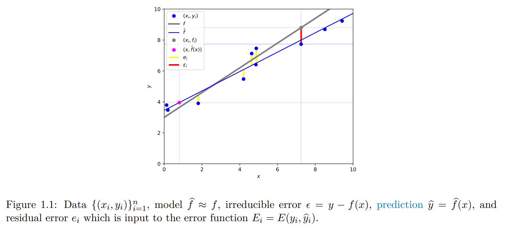

### 1. Introduction to Machine Learning

#### 1.1 Representing Data

We represent data as a matrix
$$X=\begin{bmatrix}
x_{1,1} & \ldots & x_{1,d}\\
x_{2,1} & \ldots & x_{2,d} \\
\vdots & \ddots & \vdots\\
x_{n,1} & \ldots & x_{n,d} 
\end{bmatrix}$$

- **Def - features:** the columns
- **Def - instance:** each row

Let $x_i=[x_{i,1},\ldots,x_{i,d}]$ with $x_{i,j}\iff x_{j}^{(i)}$ (same notation) be the $j$-th attribute of the $i$-th instance

- **Labels:** $y=[y_1,\ldots,y_n]^T$ such that $y_i$ is associated with each $i$-th instance $x_i$

- **Data set:** $\mathcal{D}=\{(x_i,y_i)\}_{i=1}^n\iff \{X,y\}$

> We will learn to predict y from x

#### 1.2 Model and error

The relation we are interested in modelling:
$$y=f^\star(x)+\varepsilon$$
where $f_\star$ is the true underlying model and $\varepsilon$ its **irreducible error.**

#### 1.3 Machine Learning
We want to obtain $\hat{f}\approx f_\star$. To do so, we optimize our performance metric. It can be something like accuracy or an error function. We denote our error function:
$$E(\hat{y},y)$$

It is based on the **residual** $e$
- A prediction: $\hat{y} = y + e$ 
- Its residual error: $e=y-\hat{y}$
- The error function (of the residual): $E(e)=E(y,\hat{y})$
- $\hat{y}=f_\star(x)+\varepsilon+e$

 

##### How to make a ML project
> 1. Obtain and cure data (preprocessing) $\mathcal{D}$
> 2. Choose/design your metric 
> 3. Decide a model/representation (for $\hat{f}$)
> 4. Employ a learning algo to produce $\hat{f}$
>

#### 1.4 Types of machine learning

- Supervised machine learning (if we have labels $y_1,\ldots,y_n$ in training set)
    1. If domain of labels continuous => **regression**
    2. If domain discrete => **classification**

- Unsupervised ML (no labels $y_i$ associated with instances $x_i$)
    1. Discrete values => **clustering**
    2. Continuous values => **dimensionality reduction, representation learning, density estimation**

- In reinforcement learning, we learn an agent/policy to produce outputs which are actions to take in an environment, and receive inputs which are states (or observations of states in that environment), rather than a data set.