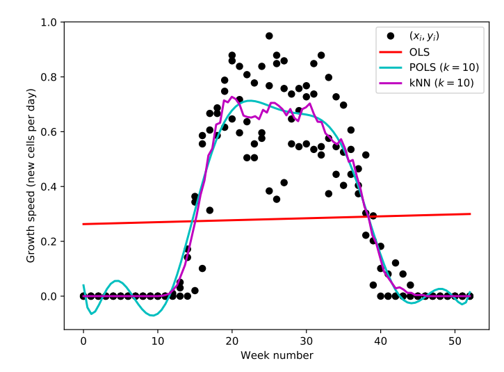

### Lecture 2 - Regression

#### 2.1 Ordinary Least Squares (OLS)

We assume training data in the form of inputs $X$ and output labels $y$ and the following model:
$$\hat{w}=[\hat{w}_1,\ldots,\hat{w}_n]^\top \\
\hat{y}_i = x_i\hat{w}=\hat{f}(x_i)\\
\hat{y}=X\hat{w}=[\hat{f}(x_1),\ldots,\hat{f}(x_n)]^\top$$

We consider the **squared error** metric
$$E_i=E(y_i,\hat{y}_i)=(y_i-\hat{y}_i)²=e_i²$$
> Wrt the $\text{i-th}$ training example

When we write this wrt a weight vector ·w· and wrt all examles in the training set, it is called the **residual sum of squares**
$$E(w)=\sum_{i=1}^n E_i = \sum_{i=1}^n e_i²$$

Bu taking the derivative and setting it equal to 0 we get,
$$w=(X^\top X)^{-1}X^\top y$$
> Sometimes **closed-form solutions** like this do not ‘feel like’ machine learning, but we should take this option whenever we feel the necessary assumptions will match our problem

#### 2.2 Issues with OLS
1. Thee relationship between the input and output is not always linear
2. No **collinearity** in the input data
3. Data points have been sampled identically and independently from the underlying distribution
4. The irreducible error has mean 0, and is Gaussian- distributed, $\epsilon \sim \mathcal{N}(0, \sigma²)$
5. **hommoskedasticity** i.e. the variance of the error is constant across the input space, so $\epsilon$ is also allways the same for any $x$

#### 2.3 Basis Functions adn Polynomial Regression (Non-Linear Least Squares)
We can use **basis functions** to transform the input space into a higher dimensional space, where we can fit a linear model. This is called **non-linear least squares**.

When non-linear relationships are suspected but we have no domain insight to work from, we can turn to **polynomial regression**. This is a special case where the basis functions are polynomials of the input. e.g $\phi = [1,x_1,x_2, x_1x_2, x_1²,x_2²,(x_1x_2)²,\ldots,x_1^k,x_2^k, (x_1x_2)^k]$

We fit linear regression (e.g. OLS) to these features $\phi$. So OLS provides $\phi w$ - a linear combination. Now there is a linear transformation from $\phi$ to $\hat{y}$. However, $\\phi text{-functions}$ are non-linear thus, there has been a non-linear transformation from $x$ to $\hat{y}$.

#### 2.4 Dealing with Collinearity

In OLS we need to invert $(X^\top X)^{-1}$ but this is **not possible** iff variables are collinear!
> In ordinary least squares (OLS), the goal is to find the parameters of a linear regression model that minimize the sum of the squared residuals. The solution for these parameters involves inverting the matrix $(X^\top X)$, where $X$ is the design matrix of the explanatory variables.

We then consider $x_2$, deterministically dependent on $x_1$ as $x_2=2.2\cdot x_1$

$$\begin{align}
\hat{y} &= \hat{w}_1 x_1 + \hat{w}_2 x_2 \\
        &= \hat{w}_1 x_1 + \hat{w}_2 2.2\cdot x_1 \\
        &= (\hat{w}_1+2.2\cdot \hat{w}_2)x_1
\end{align}$$

>  $\hat{w}$ is the vector of estimated regression coefficients for the linear regression model with explanatory variables $x_1$ and $x_2$. Specifically, $\hat{w}=[\hat{w}_1, \hat{w}_2]$ are the estimated coefficients for $x_1$ and $x_2$, respectively. The expression $\hat{w}_1 x_1 + \hat{w}_2 x_2$ represents the predicted value of the response variable $\hat{y}$ based on the estimated coefficients $\hat{w}$ and the values of the explanatory variables $x_1$ and $x_2$.
There are an *infinite number of possibilities for* $\hat{w}=[\hat{w}_1,\hat{w}_2]$
#### 2.5 Gradient Descent (GD)

In gradient descent, rather than solving for $\hat{w}_{OLS}$ we essentially stop the derivation at the point where the derivative is 0. We then update the weights in the direction of the negative gradient. This is done iteratively until convergence.

$$\begin{align}
    0=g&=-2X^\top y + 2(X^\top X)w\\
    &= -X^\top (y-Xw)\\
\end{align}$$

$g$ is our gradient. It points in the direction of the higher errror. SO we descend away from that direction. How much we descend is determined by the **learning rate** $\alpha$.
We start with some random $w$  and chose $\alpha$ and then we update $w$ as follows:
$$w\leftarrow w-\alpha g$$

If the function is convex, it will converge!

#### 2.6 Dealing with Hetroskedasticity

Heteroskedasticity is when  the underlying distribution is a different shape for different locations $x$. 

> Example where both the assumptions of linearity and homoskedasticity are broken.

The method of $k$-nearest neighbours (kNN) is a non-parametric method for regression. It is a **lazy learner** because it does not learn a model from the data but instead stores the training data and uses it to make predictions. The prediction for a new data point is made by taking the average of the $k$ nearest neighbours in the training data. It is more suited for this since it makes no assumptions about the underlying distribution of the data.
