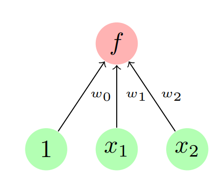
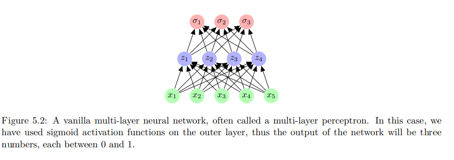

### Chapter 5 - Neural Networks: An Introduction

We can formalize several of the methods we've seen so far (e.g. linear regression, logistic regeression, polynomial regression) into the framework of **neural networks**. Or more specifically, a single neuron (or 'unit') with weights $w$ and an actvation function $f$.

Each edge represents a weight $w_j$ (here: $w=[w_0,w_1,w_2]$); the output of this neuron is $f(w^Tx)$

The *model* is represented by multiple activation functions (and correspondingly multiple sets of weights).

We can now see the difference between several methods seen until now as a simplify a different choice of
1. activation function $f$ (e.g. the identity function $f(a)=a$ for linear regression; or the sigmoid activation $f(a)=\sigma(a)$ for logistic regression) 
2. error function $E(w)$ (e.g. squared error for OLS, plus a Euclidean norm penalty for ridge, log loss for logistic regression and so on)
3. optimization method (e.g., closed-form opitmization, or gradient descent) for obtaining $\hat{w}$
