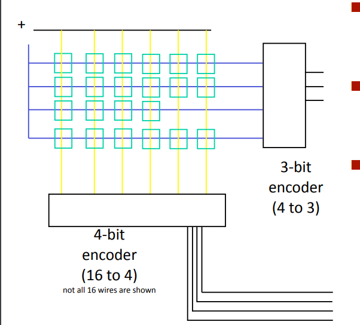

### Keyboard
- When a key is pressed, a 7-bit key identifier is computed
- The identifier goes back to 0 when the key is depressed
- The CPU might not be able to read the identifier immediately: we must somehow store it...

### Storage elements
#### Storing and Accessing 1 Bit
The basic functioning of an R-S latch can be explained as follows:

1. The R input (also called the reset input) and the S input (also called the set input) are normally held at logic level 0, which means that they are not active.

2. When the R input is pulsed to logic level 1 (also called "asserted"), the output of the latch, Q, is set to logic level 0, and the complementary output, Q', is set to logic level 1. At the same time, the latch enters the "reset" state.

3. When the S input is pulsed to logic level 1, the output of the latch, Q, is set to logic level 1, and the complementary output, Q', is set to logic level 0. At the same time, the latch enters the "set" state.

4. If both the R and S inputs are pulsed to logic level 1 simultaneously, the behavior of the latch is undefined, and it may enter an unpredictable state.

5. Once the latch has been set or reset, it remains in that state until the R or S input is pulsed again.

> Multi-bit values can be stored using the usual multi-bit trick (putting a lot of em fuckers together)

#### An edge-triggered latch
1. The edge-triggered latch stores a single bit of information.
2. It updates its output only when a clock signal transitions from logic level 0 to 1.
3. It is used in digital circuits for better noise immunity, reduced power consumption, and improved synchronization.

> Having 3 consecutive NOT gates in the WE signal is a way to generate a clean, glitch-free pulse that lasts for a specific duration

#### Memory: Register Files
- Stores multiple words of memory
  - Address input specifies which word to read or write

- Register file (for v small memories)
  - Holds values of program registers (%rax, %rsp, etc...)
> %rax and %rsp are registers in the x86-64 processor architecture. %rax is a general-purpose register that holds data and memory addresses, while %rsp is the stack pointer register that points to the top of the stack. 
  - Register identifier serves as address
  - ID 15 (0xF) implies no read or write performed
  
- Multiple Ports
  - Can read and/or write multiple words in one cycle
  - Each has separate address and data input/output.

#### Memory: Memory Arrays

- Efficiently store large amounts of data
  - Address input specifies which word to read or write

- Three common types
  - Dynaic random access memory (DRAM)
  - Static random acces memory (SRAM)
  - Read only memory (ROM)
  - ALl offer the same abstraction, but different technologies, costs and performances

### Clock and state machines
#### Register operation

- Stores data bits
- For most of the time (WE=0) acts as a barrier between input and output
  - outputs the value stored, ignores the input value
- As WE rises, loads input
> WE (Write Enable): This signal is used to enable the write operation in the register. When the WE signal is active (i.e., set to logic high), the data present on the data bus is written into the register.
> RE (Read Enable): This signal is used to enable the read operation in the register. When the RE signal is active (i.e., set to logic high), the data present in the register is output onto the data bus.
> The rising WE signal refers to the transition of the WE signal from a logic low to a logic high. This transition indicates that the data present on the data bus is valid and can be written into the register. Similarly, the rising RE signal refers to the transition of the RE signal from a logic low to a logic high, indicating that the data in the register is valid and can be output onto the data bus.

#### Key idea: clock and sequential logic circuits
- Make WE a periodic signal, called clock

- Combine
  - a combinational circuit (that performs the operation) with
  - storage elements (registers, storing info) driven by the clock
  
- The resulting circuit can perform a computation at each clock cycle reusing informations computed in the previous clock cycles

#### Summary on state machines

- **Combinational circuits** produce an output based on input values
- **Sequential circuits** use current input variables and previous input variables by storing the info and putting back into the circutit on the next clock cycle.

### The Von Neumann model
#### Limitation of state machines
- Control (the program) is hardcoded in the combinational circuit
- **Von Neumann ideas**
  - Store the program in memory
  - Design a state machine that repeatedy performs the following steps:
    - **fetch:** fetch the next instruction from memory
    - **decode:** interpret the instruction and make datas available
    - **execute:** perform the operation
    - **store:** store the result of the computation
  - In other terms, the stae machine interprets the program stored in memory
  - By updating the memory, the same state machine can perform different tasks
#### Instructions
- The instruction is the fundamental unit of work
- Specifies two things:
  - opcode: operation to be performed
  - operands: data7locations to be used for operation
- An instructioin is encoded as a sequence of bits
- The instructions and their formats are known as the Instruction Set Architechture (ISA)

- Each ISA can be implemented by different processors (e.g. Intel vs AMD)

#### SEQ stages

**State**
- Program counter register (PC)
- Condition code register (CC)
- Register File (8 general purpose registers)
- Memories
  - Access same memory space
  - Data: for reading/writing program data
  - Instruction: for reading instructions
  
**Stages**
- **Fetch:** Read instructions from instruction memory
- **Decode:** Read program registers
- **Execute:** Compute value or addres
- **Memory:** Read or write data
- **Write Back:** Write program registers
- **PC:** Update program counter
