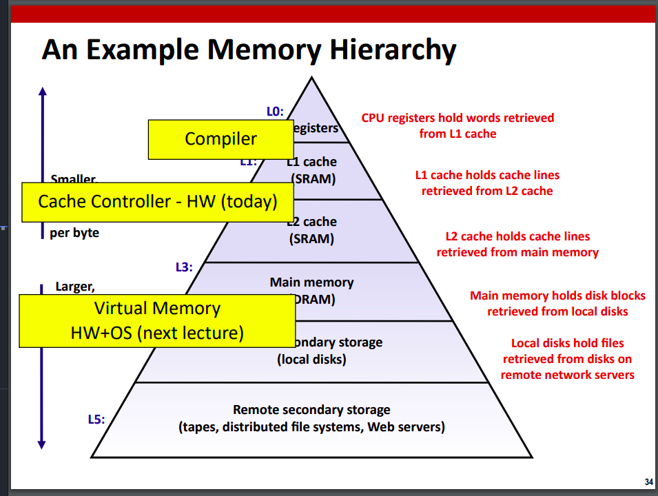

### Lecture 9: System I/O

#### Low-level I/O interface
A unix file is a seq of m bytes
> $B_0, B_1, \ldots, B_k, \ldots, B_{m-1}$

All input and output is handled in a consistent and uniform way via a simple interface

```c
int open(char *filename, int flags, mode_t mode)

// can simply be used like:
open("/etc/hosts", O_RDONLY)
```
> A "mode" only required when creating a file
> Together with umask, determines the new file's permissons
> S_IRUSR, S_IWUSR, S_IXUSR,... 

Returns a **file descriptor** which is an integer index into the kernel's file descriptor table for the current process

> The kernel's file descriptor table is a data structure used by the operating system kernel to keep track of open files and their associated metadata for each process. 
- Opening flags:
  - `O_RDONLY`: Request read-only access
  - `O_WRONLY`: Request write-only access
  - `O_RDWR`: Request both read and write access

- `close(fd)`: To close a file. Only call on a file descriptor that has been open


- `nbytes = read(fd, buf, sizeof(buf))`: Returns number of bytes read from *fd* to *buf*
  - **Short counts**: (nbytes < sizeof(buf))
>Short countes can occurr when:
> - EOF on reads
> - Reading text lines from a terminal
> - Reading and writing pipes or network sockets


- `nbytes = write(fd, buf, sizeof(buf))`: Writes bytes from memory to a file starting at its file offset

##### RIO Package
Provides a set of wrappers that provide efficient and robust I/O
Porvides:
- Unbuffered: `rio_readn`, `rio_writen`
```c
#include "csapp.h"
ssize_t rio_readn(int fd, void *usrbuf, size_t n); //Only returns a short count at end of file (only use when know how many bytes to read)
ssize_t rio_writen(int fd, void *usrbuf, size_t n); //Never returns a short count
```

- Buffered: `rio_readlineb`, `rio_readnb`


#### Trade-offs between low-level and high-level I/O abstractions
##### Unix I/O (low-lev)
- **Advantages:**
  - All other I/O packages are implemented using Unix I/O functions
  - Unix I/O provides functions for accessing file metadata
  - Unix I/O functions are async-signal-safe and can be used safely in signal handlers

- **Disadvantages:**
  - Dealing with short counts is tricky and error prone
  - Efficient reading of text lines requires some form of buffering, also tricky and error prone
  - Both of the issues addressed by using standard I/O and RIO packages

##### Standard I/O (high-lev)
- **Advantages:**
  - Buffering increases efficency by decreasing the number of **read** and **write** system calls
  - Short counts handled automatically

- **Disadvantages:**
  - No function for accessing file metadata
  - Standard I/O functions are not async-signal-safe and not appropriate for signal handlers
  - Standard I/O not appropriate for input and output on network sockets
  - Poorly documented restrictions


#### Socket interface and the interplay with standard I/O
- The kernel's file descriptor table tracks open files and their metadata for each process.
- File descriptors are integers representing open files or I/O resources.
- Each process has its own file descriptor table in the kernel's memory space.
- The table contains information like file position, access mode, and status flags.
- Processes interact with the table through system calls like `open()`, `read()`, `write()`, and `close()`.
- When a process forks, the child process inherits a copy of the parent's file descriptor table.
- The table has a maximum size, usually determined by a constant value in the kernel.
- The file descriptor table is crucial for managing I/O operations in the kernel.


### Lecture 10: The Memory Hierarchy

#### Memory Hierarchy
- **Memory hierarchy:** An approach for organizing memory and storage systems



#### Implementation of memory caches
- **Cache:** A smaller, faster storage device that acts as as staging area for a subset of the data in a larger, slower device
For each k, the faster, smaller device at level k serves as a cache for the larger, slower device at level k+1
> Because of locality, programs tend to access the data at level k more often than they access the data at level k+1. Thus, the storage at level k+1 can be slower and thus larger and cheaper per bit

- The memory hierarchy creates a large pool of storage that **costs as much as teh cheap storage near the bottom** but that **serves data to programs at the rate of the fast storage near the top**.

##### Hit/Miss in Cache:

- **Cache hit**: Data found in cache; fast access.
- **Cache miss**: Data not found; slower access, fetch from main memory.
  - **Cold (compulsory miss):** Occur because the cache is empty
  - **Conflic miss:** Level k cache is large enough, but multiple data objects all map to the same level k block
  - **Capacity miss:** The set of active cache blocks (*working set*) is larger than the cache
- Aim: Maximize hits, minimize misses.
- Techniques: Caching algorithms, replacement policies, prefetching.

##### Fully associative cache (S=1)
No restrictions on where a particular block can be stored within the cache.

- Fully associative cache with one set (S = 1) and E = 2e lines.
- Each block can be stored anywhere in the cache.
- Maximize cache memory utilization.
- Lower risk of conflicts between data.
- Finding data in the cache requires more effort.
- Decoding circuit becomes larger due to the fully associative nature.

Writes in Cache:
- Multiple copies of data exist in different levels: L1 cache, L2 cache, main memory, and disk.
- Write-hit: When a write operation occurs and the data is found in the cache.
  - Write-through: Data is immediately written to memory.
  - Write-back: Data is written to memory later when the cache line is evicted. A dirty bit is used to indicate if the line differs from memory.
- Write-miss: When a write operation occurs and the data is not found in the cache.
  - Write-allocate: Data is loaded into the cache first, and then the cache line is updated.
    - Preferred when subsequent writes to the same location are expected.
  - No-write-allocate: Data is written directly to memory without loading into the cache.
- Typical configurations:
  - Write-through with no-write-allocate.
  - Write-back with write-allocate.
> Best for matrix multiply performace: `ijk&jik`


#### How to exploit locality
- **Principle of locality:** Programs tend to use data and instructions with addresses near or equal ot those htey have used recently
- **Temporal locallity:** Recently referenced items are likely to be referenced again in the near future
- **Spatial locality:** Items with nearby addresses tend to be referenced close together in time


- **Row-Major:** In row-major order, the elements of a multi-dimensional array are stored row by row in a contiguous block of memory. This means that the elements of the first row are stored first, followed by the elements of the second row, and so on.
> Use this to have a good locality. If doing array operations, go row by row
> Go from right to left: e.g. `a[i][j][k]` do access from right to left (first iterate `a[0][0][0], a[0][0][1], ... a[0][0][n]`) then `a[0][1][0], a[0][1][1], ... a[0][1][n],..., a[0][n][n]`

### Lec 11: Virtual memory