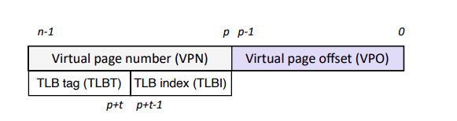

### CH 6: Memory hierarchy

#### Locality

- Arrays get allocated with "Row Major":  the elements of a 3D array are stored in memory row by row, plane by plane, in a contiguous block of memory.

```
arr[0][0][0]  arr[0][0][1]  arr[0][0][2]  ...  arr[0][0][Z-1]
arr[0][1][0]  arr[0][1][1]  arr[0][1][2]  ...  arr[0][1][Z-1]
.             .             .                   .
.             .             .                   .
arr[0][Y-1][0]  arr[0][Y-1][1]  arr[0][Y-1][2]  ...  arr[0][Y-1][Z-1]

arr[1][0][0]  arr[1][0][1]  arr[1][0][2]  ...  arr[1][0][Z-1]
arr[1][1][0]  arr[1][1][1]  arr[1][1][2]  ...  arr[1][1][Z-1]
.             .             .                   .
.             .             .                   .

```
- **Stride-k**: How much a program jumps around. Best is to access by order (basd on row major)

#### Cache Memories
- $M=2^m$: Computer system where each memory address has $m$ bits
- $S=2^s$: Cache sets. Each set consistes of $E$ cache lines. Each cache line has $B=2^b$ bytes ($B$ is the block size), a valid bit, and $t=m-(b+s)$  tag bits that uniquely identify the block in memory.

A cache's organisation can be characterized by the tuple:
$$(S,E,B,m)\\C=S\times E\times B\text{ which is the cache size}$$


When accessing an address from cache, the following steps are taken:
1. The address is split into three fields: tag, set, and block offset.
2. The set field is used to select the set.
3. The tag field is compared with the tags of all the cache lines in the set.
4. If there is a match, the cache line is selected and the data is returned.
5. If there is no match, the cache line is selected for replacement and the data is returned. (policies for replacement vary: random, least recently used, least frequently used, et)
6. If the cache line is dirty, it is written back to memory.
7. The tag field is stored in the tag field of the cache line.
8. The valid bit is set to 1.
9. The data is stored in the cache line.


##### Direct-Mapped Caches
Caches grouped into different classes based on E
- **Direct mapped cache:** $E=1$

- **Set selection in Direct-Mapped Caches:** 
  1. Extract set index
  2. Extract the word: A copy of the word is stored in the line iff the valid bit is set and the tag matches
  3. If the tag matches, the word is returned
  4. If the tag does not match, the word is fetched from memory and stored in the line. The tag is updated and the valid bit is set to 1.

##### Fully Associatives Caches (S=1)
- A block can be stored anywhere in the cache
- Maximize use of cache memory
- Less risk of conflicts
- Finding data in cache takes more effort


- Problem 6.11
  1. Pq coño 


### CH 8: Exceptional Control Flow

#### Processes
- **Process:** An instance of a program in execution
 
- `int fork(void)`
  - Creates a new process (child) that is identical to the calling process
  - Returns 0 to the child process
  - Returns child's **pid** to the parent process
  ```c
  pid_t pid = fork();
  if (pid==0){
    printf("hello from child\n");
  }else{
    printf("hello from parent\n")
  }
  ```
> Works from the line it was executed downwards

- `int wait(int *child_status)`
  - suspends current process until one of its children terminates
  - return value is the **pid** of the child process that terminated
  - if `child_status != NULL`, then the object it points to will be set to a status indicating why the child process terminated
  ```c
  void fork9(){
    int child_status;

    int (fork()==0){
      printf("hello from child");
    }else{
      printf("hello from parent");
      wait(&child_status);
      printf("Child has terminated")
    }
  }
  ```
> If `waitpid` (wait but with process id) has as an argument `-1` then it means all child processes
> Can use `WIFEXITED` and `WEXITSTATUS` to get info abt exit status

- `int execve(char *filename, char *argv[], char *envp[])`: 
  - Loads and runs in current process:
    - Executable filename
    - With argument list argv
    - And environment variable list envp: 
  - Loads and runs in current process:
    - Executable filename
    - With argument list argv
    - And environment variable list envp
  - Does not return

##### Signals
- A **signal** is a notification sent to a process when a certain event occurs in the system

| ID Name | Default Action | Corresponding Event |
|---------|----------------|---------------------|
| 2 SIGINT | Terminate | Interrupt (ctrl-c) | 
| 9 SIGKILL | Terminate | Kill program | 
| 11 SIGSEGV | Terminate & Dump| Segmentation Violation | 
| 14 SIGALARM | Terminate | Timer signal | 
| 17 SIGCHLD | Ignore | Child stopped or terminated | 

- `int kill(pid_t pid, int sig)`: send signal to process

##### Signal handlers
- `handler_t *signal(int signum, handler_t *handler)`: The signal function modifies the default action associated with the receipt of a signal signum
  - Values of handler:
    - **SIG_ING**: Ignore signals of type signum
    - **SIG_DFL**: Revert to the default action on receipt of signals of type signum
    - Otherwise, hadnler is the address of signal handler

> Misc: `sleep()` returns the number of seconds actually slept. If it gets interrupted (since it's blocking), it will return the n of seconds slept b4 interrupt

### Ch 9: Virtual memory
- **Virtual Adressing:** The CPU accesses main memory by generating a *virtual address* (VA) which is converted to the appropriate physical address before being sent to main memory.
> Task of converting a virtual address to a phisical one knownn as **address translation**
>

- **Address space:** An ordered set of nonnegative integer addresses
$$\{0,1,2,...\}$$
> If integers are consecutive we say it is a **linear address space**

In virtual memory, CPU generates virtual addrsses fro an address space of $N=2^n$ addresses called the *virtual address space*.

- **n-bit address space:** address space with $N=2^n$ addresses

#### VM as a Tool for Caching
- **Virtual Memory:** organized as an array of $N$ contiguous byte-size cells stored on the disk.
- The contents of the array on disk are cached in **physical memory** (DRAM cache). These cache blocks are called **pages** (of $P=2^p$) bytes.

<br>

- **Unallocated:** not yet allocated by the VM system (do not occupy any space on disk)
- **Cached:** allocated pages currently cached in physical memory
- **Uncached:** allocated pages that are not cached in physical memory

##### Page Tables
- A **page table** is an array of page table entries (PTEs) that maps virtual pages to physical pages 
> Let $n$ be the virtual address size. SInce each virtual page is $P=2^p$ bytes, there are a total of $2^n/2^p=2^{n-p}$ possible pages in the system, each of which needs a page table entry (PTE)

> We have a  valid bit indicating whether the virtual page is currently cached in DRAM

- **Page hit:** reference to VM word that is in physical memory (DRAM cache hit)
- **Page fault:** reference to VM word that is not in physical memory (DRAM cache miss)

##### Handling Page Fault
1. Page miss causes page fault (exception)
2. Page fault handler selects a victim to be evicted (random address from DRAM)
3. Offending instruction is restarted: page hit 
> Waiting until the last moment to swap a page into memory is known as **demand paging**

##### Locality to the recue
- Virtual memory works because of locality
- Programs tend to access a set of active virtual pages called the **working set**
- If (working set size < main memory size)
  - Good performance
- If (SUM(working set sizes)>main memory size)
  - **Thrashing:** Performance meltdown where pages are swapped (copied) in and out continuously

##### VM address translation
| Symbol | Description |
|--------|-------------|
| $N=2^n$ | Number of addresses in virtual address space |
| $M=2^m$ | Number of addresses in physcial address space | 
| $P=2^p$ | Page size (bytes) |
|---------|--------------------|
| VPO | Virtual page offset (bytes) |
| VPN | Virtual page number |
|-----|-----------------------|
| PPO | Physical page offset (bytes) |
| PPN | Physical page number |


Address translation is a mapping between the virtual address space (VAS) and physical address space (PAS)

$$MAP:CAS\rightarrow PAS\cup \emptyset$$
where
$$MAP(A) = \begin{cases}
A' & \text{if data at virtaul addr. A are present at physical addr. A' in PAS}\\
\emptyset & \text{ if data at virtual addr. A are not present in physical memory} 
\end{cases}$$

- The n-bit virtual address has two components:
  - a $p$-bit virtual page offset (VPO)
  - an $(n-p)$-bit virtual page number (VPN)
> Since the physical and virtual pages are both $P$ bytes, the physical page offset (PPO) is dientical to the VPO

##### Address Translation: Page hit
1. Processor sends virtual address to MMU
2. MMU requests a page taable entry address from memory
3. Page table entry is fetched from page table in memory
4. MMU sends physical address to cache/memory
5. Cache/memory sends data word to processor


##### Address Translation: Page hit
1. Processor sends virtual address to MMU
2. MMU fetches PTE from page table in memory
3. Valid bit is zero, so MMU triggers page fault exception
4. Handler identifies victim (and, if dirty, pages it out to disk) (dirty means if address occupied even with valid bit 0)
5. Handler pages in new page and updates PTE in memory
6. Handler returns to original process, restarting faulting instruction
> Lo mismo q antes no???

##### Speeding up Translation with a TLB
- Page table entries (PTEs) are cached in L1 like any other memory word
  - PTE hit requires a small L1 delay
  - PTEs may be evicted by other data references

- Solution: **Translation Lookaside buffer** (TLB)
  - Small hardware cache in MMU
  - Maps virtual page numbers to physical page numbers 
  - Contains complete page table entries for a small number of pages



- $T=2^t$: number of sets in TLB


- **Process:**
  1. Extract the VPN from the virtual address.
  2. Extract TLB index & TLB tag
  3. Find PPN trhoguh the TLB
  4. Concatenate PPN from the PTE with the VPO from the virtual address (forms a physical address)
  > PPO=VPO!!!
  > Also, in order to find other way round, find VPO=PPO, rest is PPN
  5. Send newly created physical address to cache
  6. Extract from it the CO, CI and CT
  7. If found, then good if not, page fault

##### Problem from the final
An entry in the level-1 page table specifies a level-2 **page table** (NOT ENTRY). An entry in a level-2 page table specifies a physical page containing actual code or data.

1. From info on the right, map the addresses from the VAS to those in the physical memory (and deduce RW and KO)
2. Next, get the vpn0 and vpn1 from the virtual address.
3. For every different vpn0 (leftmost table) index, map to a different table. Do this by pointing to the first entry on those tables
4. Now, for the vpn1 index, since we are pointing to a physical address (figured out from step 1), we shift that physical address by 2 to the left (to give space to RW and KO) and set RW and KO to their respective values


### Linking
> No practice questions were specified for this chapter???

- **Linking:** the process of collecting and combining various pieces of code and data into a single file that can be *loaded* and executed

#### Object Files, Symbol Resolution, Static Libraries

##### Static Linking
`gcc -o prog main.c sum.c`

- **Input:** A collection of relocatable object files
- **Output:** Executable object file

- **Object Files:** contain blocks of bytes
  - program code
  - program data
  - data structures for the linker and loader

- Linker - minimal understanding of target machine
  - concatenates blocks of bytes togethter
  - decides on their run-time locations
  - modifies specific locataions within the code and data


How it works:
  1. **Symbol resolution:**
     - Programs define and reference symbols *(variables and functions)*
     - Symbols definitions are stored in the *symbol table*
       - symbol table is an array of structs
       - each entry includes: name, size and location of symbol
     - Symbol resolution: associate each symbol reference with exactly one symbol def

2. **Relocation:** 
   - Compilers and assemblers generate multiple code and data sections, each starting at addr 0
   - Merges separate code and data sections into single sections
   - Relocates symbols from their relative locatiosn in the `.o` files to their final absolute memory locations in the executable
   - Updates all reference to these symbols to reflect their new positions
> The linker goes through all code & data sections & modifies the symbol references to point to the news memory locations.

##### Three Kinds of Object Files (Modules)
- **Relocatable object file (.o):**
  - Contains code and data in a form that can be combined with other relocatable object files
  - Each `.o` file is produced form exactly one source `.c` file

- **Executable object file (a.out):** 
  - Contains code & data in a form that can be copied directly into memory directly and then executed

- **Shared object file (.so):**
  - Special type of relocatable object file that can be loaded into memory and linked dynamically (ar load time or run-time)
  - Called *Dynamic Link Libraries (DLLs)* by Windows

##### Executable and Linkable Format (ELF)
Standard binary format for object files
- Unified format for:
  - Relocatable object files (.o)
  - Executable object files (a.out)
  - Shared object files (.so)
> Usually called ELF binaries
>

ELF Object File Format:
- **Elf header (16-bytes):**
  - architecture, byte ordering
  - file type (.o, exec, .so)
  - machine type, etc

- **Section header table:**
  - Array of section entries: offsets and size in file, alignment requirements, flags

- **Program header table:**
  - Segment header table
  - Describes segments
  - Segment = one or more sections, position in file, irtual addresses, memory permissions (rwx)


##### Symbol tables (.symbtab)
- `realdelf -s main.o`: to view symbol table

- Global symbols
  - Symbols defined by module $m$ that can be referenced by other modules
- External symbols
  - Global symbols that are referenced by module $m$ but defined by some other module
- Local symbols
  - Symbols that are defined and referenced exclusively by module $m$
  > Variables and functions with the **static attribute** are simply hidden using **local symbols** from references by other modules
  - non-static local C variables: stored on stack
  - static local C variables: stored in either .bss or .data
> Local linker symbols are **not** local program variables

```c
inf f(){
  // Compiler allocats space in .bss for the definition of x in f
  static int x=0;
  return x;
}
int g(){
  // Compiler allocates space in .data for def of x in g
  static int x = 1;
  return x;
}
// Creates local symbols in the table with unique names e.g:x.1 and x.2
```
- **Strong sybmol:** functions and initialized globals
- **Weak symbol:** uninitialized globals

##### Linker Symbol Rules
1. Multiple strong symbols are not allowed
   - Each item can be defined only once
   - Otherwise: linker error

2. Strong symbol and multiple weak symbols, choose strong
   - ref to weak resolve to strong

3. If multiple weak symbols, pick arbitrary

##### Static Libraries
- **Static library:**  collection of compiled object files (.o files) bundled together into a single file. It contains pre-compiled code that can be linked with a program at compile-time to create an executable.

#### Sybmol relocation
##### Relocating Symbol References
- Assembler generates an objec module without knowing where it will be placed in memory
- For each ref to an unknown address, assembler emits a dummy value and generates a reloc entry telling the linker how to update the ref
```c
typedef struct{
  Elf64_Addr r_offset; // Section offset or virtual address
  uint64_t r_info; //Symbol table index & type of relocation
  int64_t r_addend; //Signed constant used as bias
} Elf64_rela;
```

- ELF defines 32 diff reloc types
  - `R_X86_64_PC32` = Relocate a 32-bit PC-relative address
  - `R_X86_64_Plt32`= As above but using PLT for non-local symbols
  - `R_X86_64_32`= Relocate a 32-bit absolute address

#### Shared Libraries
- Static libraries disadvantages:
  - Duplication in executalbe files on disk
  - Duplication in running executables
  - Minor bug fixes in system libraries require relinking each application

- Modern **solution:** Shared Libraries
  - Object module, containing code and data, that is loaded and linked into an application *dynamically* at either load-time or run-time
  - Also called: dynamic link libraries (DLLs) or `.so` files

- **Load-time Dynamic Linking:** occurs automatically when an executable is loaded before it starts running
  - Common case for linux, handled automatically by the dynamic linker
  - Load `.text` and `.data` sections of shared libraries; perform relocation

- **Run-time Dynamic Linking:** occurs during program execution using calls to the `dlopen()` interface.
  - Providing software "plugins"
  - High-performance web servers
  - Run-time library interpositioning

Example:
```c
void *handle;
handle = dlopen("./libvector.so", RTLD_LAZY);
addvec = dlsym(handle, "addvec") //Get pointer to the addvec() function
...
dclose(handle); //Unload shared library
```

##### Position-Independent Code (PIC)
- References within the same module use PC-relative addressing
- References to external variables: **Global Offset Table (GOT)**
  - Library's code shared by all processes, but data segment duplicated in each
  - Whenever an objct module is loaded, the distance between the code and data segments never changes 
  - Store global references in the data segment in the GOT and generate relocation records for each GOT entry
- References to external functions: **Procedure Linkage Table (PLT)**

#### Library Interpositioning
##### Compile-time interpositioning

- **Library Interpositioning:** Powerful linking technique that allows programmers to intercept calls to arbitrary functions
> Can occur at compile, link, load/run time

We overwrite default functions example:
```c
void *mymalloc (size_t size, char *file, int line){
  void *ptr = malloc(size);
  printf("%s:%d malloc(%d)=%p\n", file, line, (int)size, ptr);
  return ptr;
}
```
```c
#define malloc(size) mymalloc(size, __FILE__,__LINE__)
void *mymalloc(size_t size, char *file, int line);
```

##### Link-time interpositioning
```c
#ifdef LINKTIME
/* Link-time interposition of malloc and free using the
static linker's (ld) "--wrap symbol" flag. */
#include <stdio.h>
void *__real_malloc(size_t size);
void __real_free(void *ptr);
/*
 * __wrap_malloc - malloc wrapper function
 */
void *__wrap_malloc(size_t size)
{
 void *ptr = __real_malloc(size);
 printf("malloc(%d) = %p\n", (int)size, ptr);
 return ptr;
}
```
`make hellol
gcc -O2 -Wall -DLINKTIME -c mymalloc.c
gcc -O2 -Wall -Wl,--wrap,malloc -Wl,--wrap,free \
-o hellol hello.c mymalloc.o`

Telling linker “`--wrap,malloc`” tells it to resolve references in a special way:
- Refs to malloc should be resolved as `__wrap_malloc`
- Refs to `__real_malloc` should be resolved as `malloc`

##### Recap
Interpositioning Recap
- Compile Time
  - Apparent calls to malloc/free get macro-expanded into calls to
mymalloc/myfree
  -  Requires access to the program source files.
- Link Time
  - Use linker trick to have special name resolu;ons
    - malloc " __wrap_malloc
    - __real_malloc " malloc
  - Requires access to relocatable object files.
- Load/Run Time
  g - Implement custom version of malloc/free that use dynamic linking to load library malloc/free under different names
  - Only requires access to the executable object file