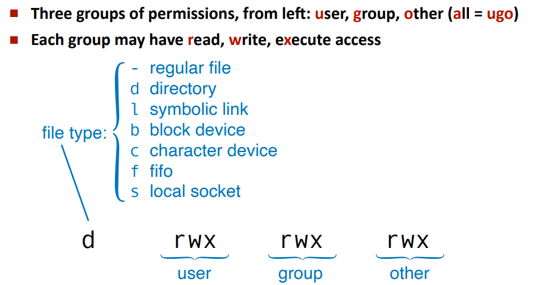

- **df** - How physical storage is mapped into the hierarchy
- **ls -l** - Shows group info

> For a directory
> - **r:** allows listing
> - **w:** allows creating
> - **r:** allows cd and access contents+metadata
##### Processes
- **PID:** Process identifier
- **PPID:** parent process identifier
- **UID and GUID:** User and group identifiers

##### Process identifiers
- `echo me=$$ parent=$PPID` shows current process id ($$) and current PPID
- `echo $?` shows return code of last command
##### Variables
- **env** - sets the environment
> `env -i X1=V1 X2=V2 sh`
- The env is exposed through: `$name, echo $HOME`
- Shell vars can be declared `ME=5`
- Only part of env if `export`
- $0: name of current script or program
- $1, $2, ..., $n: positional parameters passed to script or program
- $#: number of positional parameters passed
- $@: all positional parameters passed as separate quoted strings.

###### Strings and expression
- No expansion inside **single quotes**
- Use **double quotes** to form a string argument with expansion (like on py a fstring)

###### Pathname expansion
- Shell pattern matching
  - **\*** matches any string
  - **\*\*** matches all files
  - **\*\*/** matches all subdirectiories
  - **?** matchs any single character

###### File descriptors
- First three descriptors are `stdin`, `stderr` and `stdout`
- **<** - reads input from file
- **>** - write output to file
- **<** - reads input from file
- **2>** - redirects the standard error to a file
- **/dev/null** - black hole for data
- **1>&2** redirects stdout to the same file as stderr

##### Filters
- **wc:** count characters, words and lines
- **grep:** returns lines that match regex
- **sed:** search and replace
- **head/tail:** return lines from the top/bottom
- **seq:** generate a sequence of numbers
- **tr/cut:** translate characters/cut a line into pieces
- **tee:** copy input into files and stout

##### Lists o pipelines of simple command
- ; - sequential list
- & - asynchronous list