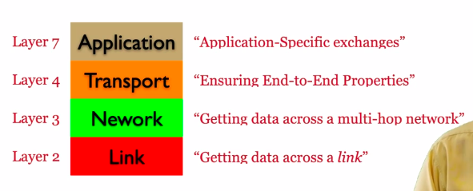
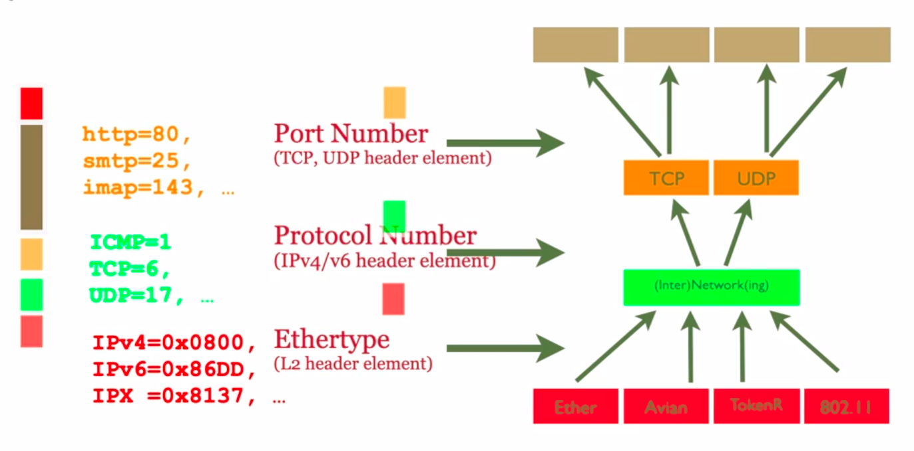
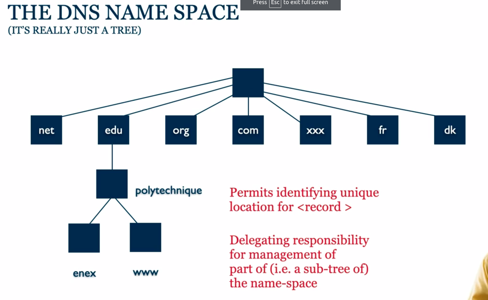
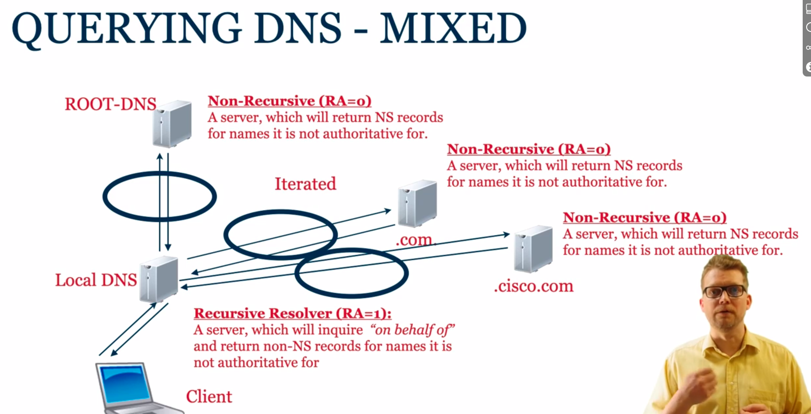

<details>
<summary> Learning Flow 20: Programming in C</summary>

#### Intro

##### The Morphology 
- Header files provide the interface and function declarations.
- Source files contain the implementations and program logic.

##### Compiling adn Linking
- **Compiling:** refers to "compile" source code (*.h and *.c) to object (*.o) files. The object files are similar to the machines language
`cc -c hello-world.c`

- **Linking:** Refers to creating an executable from object files
`cc -o hello-world hello-world.o`

The `-Wall` enable a set of warning messages during the compilation process.


##### Preprocessor Directives
Preprocessor directives, such as `#define`, `#ifdef`, `#ifndef` and `#endif`, are typically used to make source programs easy to change and easy to compile in different execution environments. 

##### Make and Makefiles
The Makefile consists a set of rules. Each rule include a target, a list of pre-requisites and a command to build/run the target:
```
target: pre-req-1 pre-req-2 pre-req-3 ...
	command-to-run
```
1. It is possible to declare variables in makefiles, by way of a statement like VARIABLENAME=VALUE
1. You then refer to the value of that variable by $(VARIABLENAME)
1. The compiler directive -Dxxxx corresponds to #define xxxx

#### Pointers, references etc

- A **pointer** is a variable that stores the address of another variable.
- The type of a pointer is the type of the variable whose address it stores.
- The unary operator `&` gives the address of a variable.
- The unary operator `*` gives the value of the variable whose address is given by the operand.
- The unary operator `*` is also used to declare a pointer variable.
>```
>type *var-name;
>```


#### Debugging with GDB
To debug a program, we need to generate debugging symbols during compilation and describe the data type of each variable. This is done by adding the `-g` option to the `cc` command.

#### Memory management in C
Whenever you want to use a structure or an array, you must deal with its allocation by yourself.

Hence, you first need to allocate buffers for the structure or array. Then, you need to free the buffers when you are done with them.

You do this by using the `malloc` and `free` functions. Or for arrays, you can simply do `int array[10]` to allocate an array of 10 integers.


##### Memory allocation functions
- `void *malloc(size_t size)`:  allocates memory.
    - **Arg:** The size in bytes
    - **Returns:** Pointer to beginning of allocated memory (type `void*` which holds address of any object type)

- `void *calloc(size_t nitems, size_t size)`: allocates memory. The difference with `malloc` is that `calloc` does not set the memory to zero.
    - **Arg:** 
    *nitems* − This is the number of elements to be allocated.
    *size* − This is the size of elements.
    - **Returns:** same as `malloc`

- `void *realloc( void *ptr, size_t new_size)`
    Reallocation can occur in two ways:
    a) By expanding or contracting the existing memory pointed to by 'ptr'. The contents of the area remain unchanged up to the smaller of the new and old sizes. If the area is expanded, the contents of the new part are undefined.
    b) By allocating a new memory block of 'new_size' bytes, copying the memory area with a size equal to the smaller of the new and old sizes, and freeing the old block.
  - **Arg:** Reallocates the given area of memory. 

> The type `size_t` is the unsigned integer type of the result of sizeof , _Alignof (since C11) and offsetof, depending on the data model.

#### Miscellaneous
- `sizeof(type)`: Queries size of the object or type (in bytes).

</details>


<details>
<summary>Learning Flow 30: Network Programming in C</summary>

#### Understand basic networking concepts

- **Hosts:** The endpoints of the internet (comps/apps). Connections terminate here
- **Routers:** In charge of carrying communications between hosts

##### Unicast/multicast/broadcast
- **Unicast:** Exactly one sender (uniquely identified), exactly one recipient (uniquely identified)
Identifier of connection flow: `({TCP | UDP}Ipaddr1,port1,Ipaddr2,port2)`

- **Multicast:** Exactly one sender (uniquely identified), a set of recipients (named but "unknown")
> Typically only supported locally (not supported on the internet)
- **Anycast:** Exactly one sender (uniquely identified), exactly one recipient (from among "unknown")
> It is a one-to-nearest communication method where data is sent from a sender to the nearest available recipient among a group of potential recipients. 

For a given transport protocol: a 5-tuple


##### Socket
We uniquely identify through "sockets" which is in the form of `Ipaddr:port`. Represents a communication endpoint. The Ipaddr identifies a computer, the port the service running on it. Described as a **tuple**.


##### Connection
- Connection setup:
  1. Server "listens" on a port
  2. Client "connects" to server
  3. Handshake: negotiate connection parameters
> The only difference between a client and server is who sends the first request. Hence Client/Server in networking: ONLY relevant for connection setup.

 
1. "Set up" connection
2. Transmit data back-and-forth
   - "read" from scoket
   - "write" to socket
3. "Tear down" connection


##### Port Number
Well-known ports: `0-1023` require root-privileges

##### Protocol Stack
- **Application Layer (layer 7):** HTTP, FTP, SMTP, DNS, ...
- **Transport Layer (layer 4):** End-to-end. TCP, UDP
> Provides a "Well-defined" transport service to uppers layer. Responsible for how packets are delivered.
- **Network Layer (layer 3):** Multi-hop. E.g: IPv4 and IPv6
> Provides as a service a "best effort" service. It will try its best to deliver the packet, but it may fail. Packets can be re-ordered and lost 
- **Link Layer (layer 2):** 1-hop. E.g.: Ethernet, WiFi, ...
> Provides as a service a "who knows" delivery semantics. It is a best-effort service. It is unreliable, unordered, and may drop packets. 

Sometimes in quizzes L2=layer 2

##### TCP/UDP
- **TCP:** Transmission Control Protocol. Connection-oriented. Reliable, in-order delivery. Flow control. Congestion control.
- **UDP:** User Datagram Protocol. Connectionless (no hand-shake needed). Unreliable, unordered delivery. No flow control. No congestion control.
> Used in some applications where reordering or loss of data is not an issue. E.g: live video streaming, VoIP, DNS, DHCP, ...

An application will choose the socket type and may also ignore the transport layer and receive raw packets from the network layer.

#### TCP - A programmers Perspective
TCP transport semantics:
  - Represent data to receiving application "as they were sent"
  - Preserve ordering, ensure reliability & integrity

1. Server bind and listen to a port, then accept incoming connection request
```c
char* msg = "Hello World !\n";
struct sockaddr_in dest; // sockaddr_in is a struct that contains an internet address
struct sockaddr_in serv; // sockaddr_in is a struct that contains an internet address
int mysocket; // Socket descriptor
socklen_t socksize = sizeof(struct sockaddr_in); // socklen_t is an integer type of width of at least 32 bits

memset(&serv, 0, sizeof(serv)); // set memory to zero
serv.sin_family = AF_INET; // sin_family is the address family
serv.sin_port = htons(PORT); // sin_port is the port number
serv.sin_addr.s_addr = htonl(INADDR_ANY); // sin_addr is the IP address

mysocket = socket(AF_INET, SOCK_STREAM, 0); //AF_INET is Address Family for IPv4 (AF_INET6 for IPv6) , SOCK_STREAM for TCP (SOCK_DGRAM for UDP), 0 means default protocol
bind(mysocket, (struct sockaddr *)&serv, sizeof(struct sockaddr)); // Associates socket with an address (sockaddr *) which encapsulates the IP address and port number
listen(mysocket, 2); //Prepares socket to accept incoming connections. 2 is the backlog, the number of connections that can be waiting while the process is handling a particular connection
int consocket = accept(mysocket, (struct sockaddr *)&dest, &socksize); // Wait for request to arrive (IT IS BLOCKING). Returns a new socket descriptor (r) that represents the accepted connection. 
close(mysocket); // Close the socket
```

> IMPORTANT: serv is of type sockaddr_in and it requires to be typecasted

2. Client "connects" to server
```c
mysocket = socket(AF_INET, SOCK_STREAM, 0); // A stream socket (TCP)
connect(mysocket, (struct sockaddr *)&dest, sizeof(struct sockaddr_in)); // Connect to server
send(mysocket, msg, strlen(msg), 0); // Send data
```

3. "Handshake": negotiate connection parameters
> Handshake done automatically

#### UDP - A Transport Protocol
UDP transport semantics:
   - "Service Minimum": Ensures packet wasn't corrupted in transit
   - Multicast-capable
UDP assumptions (from network):
   - Best effort (from network): reordering, loss, garbling possible


```c
sockfd = socket(AF_INET, SOCK_DGRAM, 0)

int sendto(int sockfd, const void *msg, int len, unsigned int flags, const struct sockaddr *to, sockln_t tolen);

```

##### Miscellaneous
- `uint16_t htonl(uint32_t hostlong)`: host to network long
- `uint16_t htons(uint16_t hostshort)`: host to network short
- `uint32_t ntohl(uint32_t netlong)`: network to host long
- `uint16_t ntohs(uint16_t netshort)`: network to host short
> Host refers to your machine's byte order 

IPv4:
```
struct sockaddr_in {
    short            sin_family;   // e.g. AF_INET, AF_INET6
    unsigned short   sin_port;     // e.g. htons(3490)
    struct in_addr   sin_addr;     // see struct in_addr, below
    char             sin_zero[8];  // zero this if you want to
};

```

IPv6:
```
struct sockaddr_in6 {
    u_int16_t       sin6_family;   // address family, AF_INET6
    u_int16_t       sin6_port;     // port number, Network Byte Order
    u_int32_t       sin6_flowinfo; // IPv6 flow information
    struct in6_addr sin6_addr;     // IPv6 address
    u_int32_t       sin6_scope_id; // Scope ID
};
```

</details>


<details>
<summary>Learning Flow 40: Concurrent Programming in C</summary>

#### Concurrency - A Programmers Perspective
Works on any type of processor.


We link our programs with the pthreads library
`cc MYPROGRAM.o -o MYPROGRAM -lpthread`

##### Creating a thread
Normally when a program starts up and becomes a process, it starts with a default thread. So we can say that every process has at least one thread of control.  A process can create extra threads using the following function :
- `int pthread_create(pthread_t *restrict tidp, const pthread_attr_t *restrict attr, void *(*start_routine)(void *), void *restrict arg)`
    - `tidp`: pthread_t type address. Hold the thread ID of the newly created thread.
    - `attr`: (CAN LEAVE AS NULL) contain certain attributes which we want the new thread to contain.  It could be priority etc.
    - `start_routine`: is a function pointer. 
    - `arg`: (CAN LEAVE AS NULL) the *sole* argument passed to the function

##### MUTEX & Condition Variable

Code that is running threaded might get "interlaced". To fix that, we surround the code that we don't want interlaced with a mutex locked.

```c
char last = 'b'
pthread_mutex_t lastMutex = PTHREAD_MUTEX_INITIALIZER;

void *print_a(){
    while (1){
    pthread_mutex_lock(&lastMutex);
    if (last == 'b'){
        printf("a");
        last = 'a'
    }
    pthread_mutex_lock(&lastMutex)
    }
}

void *print_b(){
    while(1){
    pthread_mutex_lock(&lastMutex);
    if (last=='a'){
        printf("b");
        last = 'b';
    }
    pthread_mutex_lock(&lastMutex);
    }
}
```

But there is a problem; if `print_a()` gets executed first and `last!=b`, it will keep on going. This is due that as long as the mutex is held, the other thing won't execute

We fix that with **condition variables**

```c
char last = 'b';
pthread_mutex_t lastMutex = PTHREAD_MUTEX_INITIALIZER;
pthread_cond_t lastStateChange = PTHREAD_COND_INITIALIZER;

void *print_a(){
    while(1){
        pthrad_mutex_lock(&lastMutex);
        while (last!='b'){ // We check the variable last but no bueno

            //We put it in a while loop because there might be other functions
            // Whenever we do a cond_wait, ALWAYS check if the condition you were waiting on has been met

            //Suspends self, and waits on conditional variable
            pthread_cond_wait(&lastStateChange, &lastMutex);
            // We release the mutex
        }
        last = 'a';
        printf('a');
        pthread_cond_signal(&lastStateChange); //We signal on the condition variable
        pthread_mutex_unlock(&lastMutex);
    }
}
```


##### Other thread operations
- `noreturn void pthread_exit(void *retval);`: terminates the calling thread and returns a value via retval 
- `int pthread_join(pthread_t thread, void **retval);`: waits for the thread specified by thread to terminate.  If `retval` is not NULL, then `pthread_join()` copies the exit status of the target thread into the location pointed to by retval.
</details>


<details>
<summary>Learning Flwo 50: Network Architectures</summary>

#### 50 - Protocol Stacks & The Layered Architecture

##### Roles & Responsibilities of each layer
- Layer 7 - **Application layer:** Application-Specific
- Layer 4 - **Transport layer:** Ensuring End-to-End properties
- Layer 3 - **Network layer:** Gets data across a multi-hop network
> Figure out what to do with a given packet
- Layer 2 - **Data link layer:** gets data across a *link*



##### Understand how layers interact with each other

We imagine two protocols stacks connected with a link (A->B)
**Computer A**
1. Application layer: Decides which transport layer to use
```c
sockfd = socket(AF_INET, SOCK_STREAM, 0); //TCP
sockfd = socket(AF_INET, SOCK_DGRAM, 0); //UDP
```
Then it envokes `.send` on the socket

2. Transport layer: adds its own header to the packet.
(For TCP it may contain sequence number, ack number, etc)
Then it calls upon a service from the network layer

3. Network layer: adds its own header to the packet. (For IPv4 it may contain source IP, destination IP, etc)
Then it calls upon a service from the data link layer

4. Data link layer: adds its own header and often a footer to the packet. (For Ethernet it may contain source MAC, destination MAC, etc)

5. Packt is sent through the link

**Computer B**
1. Data link layer: removes the header and footer
2. Network layer: removes the header and processes. This decides whether the packet should be sent to the transport layer or forwarded to another computer.
3. Transport layer: removes the header. This indicates to which application the packet should be sent to.
4. Application layer: receives the packet
5. Application layer: returns the packet to the user


> MEMORIZE DIAGRAM

#### 51 - On Identifiers in Computer Networking

##### Identifiers In The Stack
- What does `http://www.example.com:80/filename.html` tell?
  - `www.example.com` formally known as "the fully qualified domain name" (FQDN). Through *DNS lookup*, it is translated to an IP address.
    1. On the internet, routers use the IP address to foward messages, finding paths through the network to the destination. More specifically, the router to which the destination is connected. 
    2. On the link between the router and the destination, there are many devices connected. The router using an *ARP(IPv4)/Neighbour Table(IPv6)* finds the Layer 2 address of the destination (incorrectly called the MAC address). 
    3. If it does not find it, it broadcasts a `neighbor-solicitation` message (IPv6) or a `who-has` (IPv4). 
    4. Only the machine with the matching IP address will respond with a `neighbor-advertisement` (IPv6) or a `is-at` (IPv4).
    5. Once responded, router updates it swithching table.

In summary: to identify, unambiguously, one single resource on the internet.
</details>


<details>
<summary>Learning Flow 60: The Domain Name System</summary>

#### What is the Domain Name system
- IP address == Point-of-attatchment in the Internet
> Does not indicate a geo location

##### How does one reach facebook.com
1. **Query DNS Server:** Returns IP address of facebook.com
2. **Figure out if destination is local:** Looks at IP address of the destination. Every address, where the first 64 bits are identical to the 64 first bits of the PC's address => it's local
3. **If IP not local:** Send packet to default gateway (found in routing table of computer)

##### Historical context
- In the beginning there was ARPANET (few hosts connected). No IP addresses, only "network numbers"
- Solution (1971): HOSTS-TXT - /etc/hosts
    >- `<name>:<IPaddr>`
    >- Manually copied to all hosts on ARPANET 

- Problem: /etc/hosts
  - Didn't scale
  - Out-of-date info
  - Anyone could "break" ARPANET

- Build something better: DNS
> (ISI-USC made the initial design, essentially as it is used today)

###### Main concepts
- DNS == A Distributed Database
- Load-Sharing/Load-Balancing
- Abstraction and Redirection
- Resource sharing
- Mapping between `<name>` and `<record>`
- `<name>`
  - hierarchically stuctured name-space
  - single-source for authorative correspondig `<record>`
  - de-centralised management
- `<record>`
  - (type,value,lifetime)

#### The Name Space Organisation
Computers read the Fully Qualified Domain Name from right to left.



The goal is to delegate responsability and distribute responsability to the servers.

1. "The root", contains reference to a record where the server where the records should be made available
> The "responsability" for `.edu` is delegated to a server which is in charge of all records which end in `.edu`
This applies recursively until reaching the server that contains all the records for `polytechnique.edu`

These servers are known as "Authoritative Servers" and the "zones" to which a responsability have been delegated, are called "Authoritative Zones".

Authoritative Zones have zone-files containing a name and a record/redirect.

- The records for the servers responsible for `.edu, .com etc` are called "nameserver (NS) records"
- The records for the servers responsible for `www.polytechnique.edu, enex.polytechnique.edu` are called "address (A) records".

- **FQDN:** A fully qualified domain has a trailing dot - allows to precisely indicate where precisely in the tree the records exist.

#### Name Resuolution
##### A bit of terminology

**Computer (stub resolver)** <-> **Local DNS** <-> **ROOT-DNS** (Knows who is maintaining records for all given domains)

Then,

**Local DNS** <-> **Authoritative Server** (Authoritative for a given domain)
> Local DNS may cache - ideally not more than the lifetime of the record. (Recursive Resolver, Local Resolver, Caching Resolver)

> If a recursive resolver has no clue about where to find the resource records, corresponding to a given hostname, then it will request info from the ROOT-DNS
##### Querying DNS
- **DNS:** Domain Name System/Service/Servers
When querying a DNS server, tuples like these are being exchanged:
`(name, type, record, lifetime)`

##### Querying DNS - Mixed

The root-dns does not act as a recursive resolver due to performance reasons.




##### DIG - Recursion unavailable
This is the case where we contact directly the ROOT-DNS.

1. We try finding the address for *google.fr*
2. ROOT-DNS (recursion unavailable): Replies with an NS record (also provides A record for the Nameservers). Allows pc to query DNS server directly. with the following flags:
  - `rd==1`: Recursion desired
  - `ra==0`: Recursion available
  - More Flags Available:
    - `qr`: Query response
    - `ad`: Authenticated data
> Client asked for recursion but not available, hence received NS record instead of A
> When recursion available `ra==1`, it returns no NS recors but an A record.

#### Resource records

> FQDN = Fullly Qualified Domain Name

| Record Type | Name | Value | Extra Info |
|-------------|------|-------|------------|
|     A  | FQDN |   IPv4 address  | FQDN->IPv4 Address |
|     AAAA | FQDN |   20  | Reason why it's 4A's it's because IPv6 is 4x larger|
|     CNAME | FQDN |   Canonical name  | FQDN->FQDN |
|     MX | FQDN |   Mailserver  | FQDN->(FQDN, priority) |
|     TXT | FQDN |   Random text...  | FQDN->Text |
|     NS | FQDN |   Authoritative Name Server  | FQDN->FQDN |

Before, we had seen that
`name-> (type, record, lifetime)`
But in reality:
`(name, type)-> (record, lifetime)`
> This means for a single name there exists several resource recors with different types. You can also find that a name+type can map into several records (as in MX)

##### MX records
Many reasons to use MX records. A company might have various subdomains to indicate where the person works
```
user@sales.example.com
accountant@accounting.example.com
engineer@development.example.com
```
and all of that might be handled by the same mail server `mailhost.example.com`.

- It contains a field **priority**. We can specify many mail servers for a single domain in case one fails and it goes in the order of priority

#### The DNS Root
- 13 root servers (each a replica of each other) (anycast, ---)
- Highly available
- {a-m}.root-servers.net
- "Bare" DNS server needs to know one (root, other) DNS server, only

<br>
<br>

- Registration of FQDN requires guarantee (at least 2) name servers available to be authoritative
- MUST obviously be kept synchronised

##### Alternate Roots - ALT.ROOT
- The DNS root is controlled by ICANN
  - Mariana del Ray, California, USA
  - US Dept. of Defence influenced
  - Also, "politically correct"
  - Delegates "official" TLDs - slowly

- Alternative named.root exist (OpenNIC, ...)
  - Typically including all ICANN TLDs (import ICANN)
  - Plus .porn, .per, .web, ...
  -  Occasional conflicts (.xxx)
  -  Not all Internet users can access these domains (need to modify hosts file)

##### Main takeaways
- The "Official" unique DNS root zone
  - One zone file
  - Maintained by ICANN
  - 13 root DNS servers
  - Each of the 13 root DNS servers is globally replicated

- Alternative roots exists
  - A root is just a zone file that people agree

#### DNS & The protocol stack

</details>