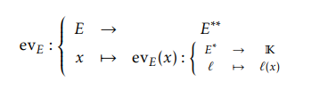

> from  prop 4.3 to corollary 7.5 (pg 13)

#### 5. Duality pairing
- **Def 5.1:** Consider a map $\varphi:E\times F\rightarrow \mathbb{K}$. This map is said to be:
  - **Linear in the first argument** if $\forall x_1,x_2\in E,\ \forall y\in E,\ \forall \lambda\in\mathbb{K}$
    $$\varphi(x_1+\lambda x_2, y)=\varphi(x_1,y)+\lambda\varphi(x_2,y)$$
  - **Linear in the second argument** if $\forall x_1,x_2 \in E,\  \forall y_1,y_2\in F,\ \forall \lambda\in\mathbb{K}$,
    $$\varphi(x,y_1+\lambda y_2) = \varphi(x,y_1)+\lambda\varphi(x,y_2)$$

  - **Bilinear** if it is linear in the first and second argument

- **Def 4.2 - non degenerate:** A bilinear map $\varphi:E\times F\rightarrow \mathbb{K}$ is said to be *non-degenerate* if:
  1. For any $x\in E$, if $\varphi(x,y)=0$ for all $y\in F$ then $x=0$.
  2. For any $y\in F$, if $\varphi(x,y)=0$ for all $x\in E$ then $y=0$
   A non-degenerate bilinear map is also called a *non-degenerate pairing*.

- **Def 5.3 - Duality bracket:** The map
$$\begin{align*}
\langle,\rangle:E^*\times E &\rightarrow \mathbb{K}\\
(l,x) &\mapsto l(x)
\end{align*}$$
> Como $E^*$ es el set de los linear maps en E, esta funcion equivale a $l(x)$

- **Prop 5.4:** The map $\langle,\rangle$ is a non-degenerate pairing.

- **Theo 5.5:** If $\varphi:E\times F\rightarrow \mathbb{K}$ is a non-degenerate pairing, then the linear maps

$$\begin{align*}
  \Phi_1:E &\rightarrow F^*\\
  x &\mapsto \varphi(x,\cdot)
\end{align*}\ \ \text{ and }\ \ 
\begin{align*}
   \Phi_2:F &\rightarrow E^*\\
   y &\mapsto \varphi(\cdot, y) 
\end{align*}
$$
are both isomorphisms.
> Lo mapean a $\varphi$, con el otro argumento siendo $\cdot$ indicando q cualquier cosa vale

#### 6. Bidual

We consider the non-degenerate pairing
$$\langle,\rangle:E^*\times E\rightarrow \mathbb{K}$$
From *Theorem **5.5***, we obtain two isomorphisms
$$\begin{align*}
  \Phi_1:E^* &\rightarrow E^*\\
  l &\mapsto \langle l,\cdot \rangle
\end{align*}\ \ \text{ and }\ \ 
\begin{align*}
   \Phi_2:E &\rightarrow (E^*)^*\\
   x &\mapsto \langle\cdot, x \rangle 
\end{align*}
$$
One has $\Phi_1=id_{E^*}$.
We will denote $\Phi_2$ by $ev_E$:

- **Def 6.1 - Bidual:** The *bidual* or *double dual*, of $E$ is the vector space $E^{**}:=(E^*)^*$

#### 7. Hyperplanes

- **Def 7.1:** A linear subspace $H\subset E$ is said to be a *hyperplane* of $E$ if $\exists l\in E^*\setminus \{0\}$ such that
$$H=\ker l$$

- **Theo 7.2:** Let $H\subsetneq E$ a linear subspace of $E$. Then $H$ is a hyperplane iff $\forall\Delta\subset E$ such that $\Delta\not\subset H$, one has
$$E=\Delta\oplus H$$

- **Corollary 7.3:** Suppose that $\dim H=n\lt +\infty$. Then a linear subspace $H\subset E$ is a hyperplane iff
$$\dim H = n-1$$

- **Theo 7.4:** Let $H\subset E$ a hyperplane of $E$. If $l_1,l_2\in E^*\setminus \{0\}$ satisfy $H=\ker l_1=\ker l_2$, then there exists $\lambda\in\mathbb{K}^\times$ such that $l_1=\lambda l_2$

> The notation $\mathbb{K}^\times$ typically refers to the multiplicative group of nonzero elements in a field $\mathbb{K}$. In other words, $\mathbb{K}^\times$ is the set of elements in $\mathbb{K}$ that have multiplicative inverses in $\mathbb{K}$.
>For example, if $\mathbb{K} = \mathbb{R}$, then $\mathbb{K}^\times = \mathbb{R} \setminus {0}$, since the only nonzero real number that does not have a multiplicative inverse is 0. If $\mathbb{K} = \mathbb{C}$, then $\mathbb{K}^\times = \mathbb{C} \setminus {0}$, since every nonzero complex number has a multiplicative inverse in $\mathbb{C}$.

> El viejo notation era $\mathbb{K}^*$ pero ahora se usa $\mathbb{K}^\times$ para evitar confusiones

- **Corollary 7.5:** One has a bijection
$$\{\text{hyperplanes of E}\} \iff (E^*\setminus\{0\})\setminus\mathbb{K}^\times$$
> En el libro después del seguno paréntesis pusieron $/$ en vez de $\setminus$ pero creo que es un error