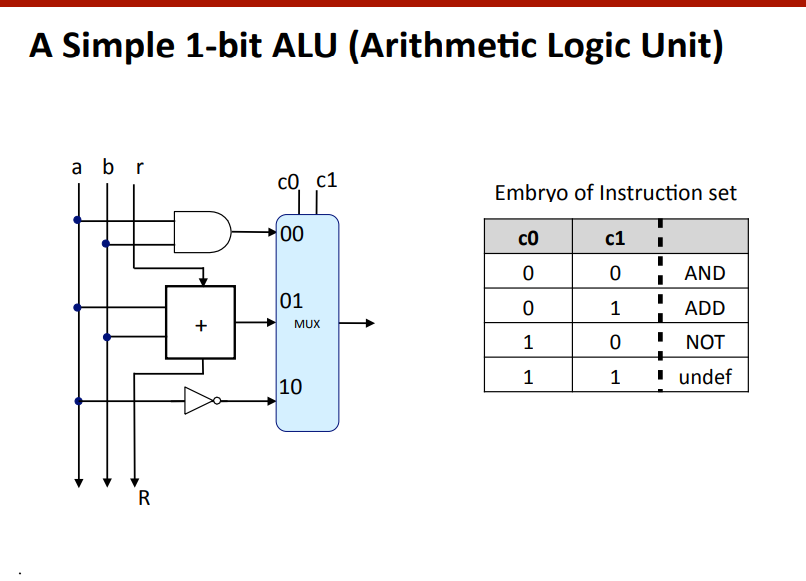

### Lecture 2 - Bits, bytes and integers

#### Bit Equality
> Generate 1 if $a$ and $b$ are equal

`bool eq = (a&&b)||(!a&&!b)`
> HCL stands for Hardware Description Language, which is a specialized programming language used to describe the behavior and structure of digital circuits and other hardware systems. 
#### Bit-Level Multiplexor
- Control signal $s$
- Data signals $a$ and $b$
- Output $a$ when $s=1$, $b$ when $s=0$
`bool out = (s&&a)||(!s&&b)`

#### Word Multiplexor
HCL representation
```hcl
int Out =[
    s : A;
    1: B;
];
```
- Select input word A or B depending on control signal S
- Think of if-then-else at the hardware level
- HCL representation: 
  - Case expression
  - Series of `test:value` pairs
  - Output value for first successful test

#### Bit Addition (half)
Given a and b, we compute two values:
- s is the sum of a and b,
- r is the carry

- HCL Expressions
  - `bool s = (a&&!b)||(!a&&b)`
  - `bool r = (a&&b)`

- Truth table
 
| a | b | s | r |
|---|---|---|---|
| 0 | 0 | 0 | 0 |
| 0 | 1 | 1 | 0 |
| 1 | 0 | 1 | 0 |
| 1 | 1 | 0 | 1 |
 
#### Bit Addition (full)


#### n-bits addition
- We can compute an n-bits addition by chaining n 1-bit adders
> This circuit is very slow because the carry must propagate across all adders. Advanced, fast, circuits implement fancy carry-lookahead.



### Integers: unsigned and signed
#### Encoding *Unsigned* integers
`41 : 101001` the first bit (from the left) is the MSB (most significant bit) the last one the LSB
$$B2U(X)= \sum_{i=0}^{2-1} x_i\cdot 2^i$$
> Binary to unsigned int
- Two possible values: Vdd and Vss, 1 and 0
- Base 2
- Bit: **bi**nary **d**digit
- **n-bit word:** nº of bits used in processor operations.


#### Encoding *Signed* Integers
- Solution 1:
  - Add one bit to store the sign: sign=MSB
  - Two representations for `0: 0000` and `1000`
  - Examples: `2=0010` and `-2=1010`

- Solution 2: **Negative value = logic complement** (1's complement)
  - Suppose word size = 4 bits
  - Two representations for `0: 0000` and `1111`
> In one's complement, negative numbers are represented by flipping all the bits (0s become 1s, and 1s become 0s) of the corresponding positive number, and adding a sign bit at the leftmost position to indicate whether the number is positive or negative.

- Solution 3 - 2's Complement representation:
  - Negative value = (logic complement + 1) mod 2^(word size)
  - Suppose word size = 4 bits
  - Examples: `2=0010` and `-2 = (1101 + 1) mod 2^4 = 1110`
  - 0 represented by `0000`

$$B2T(X) = x_{w-1}\cdot -2^{w-1} + \sum_{i=0}^{w-2} x_i\cdot 2^i$$

#### Overflow and 2's complement representation
- Negative value = (logic complement + 1) mod 2^(word size)
- Suppose word size = 4 bits
- Greatest n representable: `0111=7`, smallest: `1000=-8`
- The most important bit specifies the signs (0:positive, 1:negative)
- If overflow, the sign of the result changes

### Bit level manipulations

#### Bit-Level Operations in C
- Operations &, |, ~ (not), ^ (xor) available in C
- Apply to any integral data type
  - long, int, short, char, unsigned

#### Logic operations in C
- Contrast to Logical operators
- &&,||, !

#### Shift operations
- Left shift: `x<<y`
- Right shift `x>>y`

### Integers: conversions


$$\begin{equation}
ux=
    \begin{cases}
        x & \text{if } x\ge 0\\
        0 & \text{if } x\lt  0 
    \end{cases}
\end{equation}$$

#### Signed vs. Unsigned in C
- Constants
  - By default are considered to be signed integers
  - Unsigned if have "U" as suffix

- Casting
  - Explicit casting between signed & unsigned as explained
    ```c
    int tx, ty;
    unsigned ux, uy;
    tx = (int) ux;
    uy = (unsigned) ty;
    ```
  - Implicit casting also occurs via assignments and procedure calls
    ```c
    tx = ux;
    uy = ty;
    ```

- Expression evaluation
  - If there is a mix of unsigned and signed in single expression, **signed values implicitly cast to unsigned**