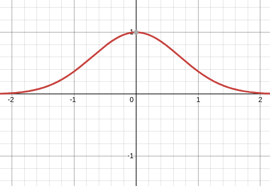

#### Exercise 1
##### Part 3
- $\ln(1+x)<x,\ \forall x\in\mathbb{R}$

#### Exercise 2
- Cauchy-Schartwz inequality
$$(\sum_{k=1}^n|a_kb_k|)^2\le(\sum_{k=0}^n |a_k|^2)(\sum_{k=0}^n|b_k|)$$

#### Exercise 3
##### Part 2
- **Gaussian integral:** 
$$\int_{-\infty}^\infty e^{-ax²}=\sqrt{\frac{\pi}{a}}$$
> Como es simétrico, se puede pillar desde 0 y es la mitad del resultado

Aquí es con $y=e^{-x²}$

También cuando se hace para ver si es unform convergent, $|f(x)-f_n(x)|$ NO sustituir directamente el límite, sino la función correspondiente. En este caso, $f(x)=\int_0^\infty e\ldots$

##### Part 3
Es más útil a veces usar
$$|f_{n+1}-f_{n}|$$ para provear unif. conv.

#### Exercise 4
On a domain of a function which is compact (closed n bounded) we can use any norm in order to prove unifrom convergence. In this case we use the infinity norm (since all norms are equivalent)

#### Exercise 5
Boundea x arriba encontrado un valor de x para q sea el max. Hacer a través de shwartz o derivar y =0

#### Exercise 6
De nuevo, usó el hecho de que el set era complete y usó el supremum para provear uniform convergence