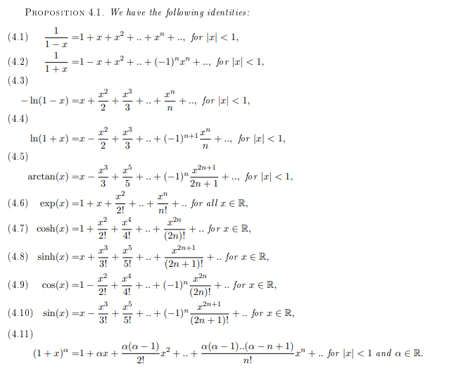

- **Theo 3.6:** Let $(a_{i,j})$ be a sequence indexed by two indeces $i,j\in\mathbb{N}$. Let
$$b_i=\sum_{j=0}^\infty |a_{i,j}|\in\mathbb{R}_+\cup\{+\infty\}$$
for every $i\in\mathbb{N}$. Then, if the series $\sum_i b_i$ is convergent we have:
  - For each $j\in\mathbb{N}$, the series $\sum_i a_{i,j}$ is absolutely convergent and similarly, for the series $\sum_j a_{i,j}$ is absolutely convergent;
  - The series
    $$\sum_i\sum_{j=0}^\infty a_{i,j}\text{ and }\sum_j\sum_{i=1}$$
    are both absolutely convergent
  - The equality 
    $$\sum_{i=0}^\infty \sum_{j=0}^\infty a_{i,j}=\sum_{j=0}^\infty\sum_{i=0}^\infty a_{i,j}$$

- **Def 3.7 - accumulation:** Let $E$ be subset of $\mathbb{R}$. Then, we say that $x\in\mathbb{R}$ is an accumulation of $E$ if there exists a sequence $x_n\in E$ such that $x_n$ are all distinct and $x_n$ converges to $x$ as $n\rightarrow\infty$

- **Theo 3.8:** Let $\sum a_n z^n$ be a power series with radius of convergence $R\gt0$. If the sets of $x\in(-R,R)$ such that $\sum_{n=0}^\infty a_nx^n=0$ has an accumulation point in $(-R,R)$ then we have $a_n=0$ for all $n$.

- **Prop 5.1:** For all $u,v\in\mathbb{C}$, we have 
$$\exp(u+v)=\exp(u)\exp(v)$$

- **Prop 5.2:** For all $t\in\mathbb{R}$, we have
$$\exp(it)=\cos(t)+i\sin(t)$$
