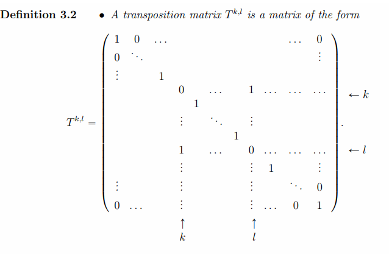
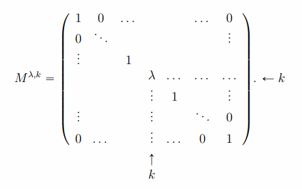
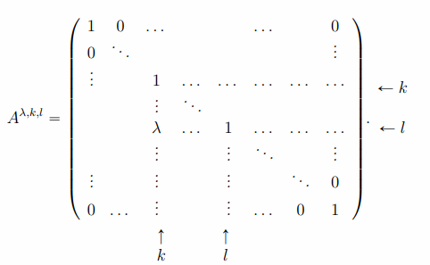

### Lecture 1 - Determinant and inverses

### 3. Matirx inverse
#### 3.2 Elementary matrices
- **Def 3.1 - invertivle:** $A$ invertibile if $\exists A^{-1}\in\mathbb{R}^{N\times N} : AA^{-1}=I=A^{-1}A$ 
- **Prop 3.1:** The following are equivalent
    1. $A\in\mathbb{R}^{N\times N}$
    2. $\forall b\in\mathbb{R}^N$, (1) has a unique solution $V\in\mathbb{R}^N$
    3. The columns of $A$ are linearly independent. 
        $$\sum_{j=1}^N \lambda_j C^j = 0_{\mathbb{R}^N}\implies \lambda_j=0 \forall j$$
        
- **Proposition 3.2:** Assume $A$ and $B$ invertivle then
$$(AB)^{-1}=B^{-1}A^{-1}$$
    - If $A$ invertible then $A^T$ invertible and 
    $$(A^{-1})^T = (A^T)^{-1}$$
    - $A$ invertible then $A^{-1}$ invertible with $(A^{-1})^{-1}=A$
    - $A$ invertible and $\lambda\ne 0$ then $\lambda A$ invertible and $(\lambda A)^{-1}=\frac{1}{\lambda}A^{-1}$

---

- A permutation matrix $P$ product of transpotion matrices
$$P=(\prod_{k=1}^K T^{i_k,j_k})$$
> It is composed of 0 and 1, has only one 1 per row and per column

- The signature $\epsilon(P)$ of a permutation matrix $P$ is 
$$\epsilon(P)=(-1)^K$$
where $K$ is th number of transposition matrices $T^{i_k,l_k}$ that compose $P$ i.e.
$$P=\prod_{k=1}^K T^{i_k,l_k}$$

- **Property 3.1**
  - This matrix exchanges the $\text{k-th}$ and the $\text{l-th}$ coefficient of a vector
  - $T^{k,l}=(T^{k,l})^{-1}=(T^{k,l})^T$
  - $P^{-1}=P^T$

---

- **Def 3.3 - Row multiplication matrix:** Matrix $M^{\lambda,k}$ of the form

- **Property 3.2:** 
  - This matrix multiplies the $\text{k-th}$ coefficient of a vector by $\lambda$
  - If $\lambda\ne 0$, then $M^{\lambda,k}$ invertible and
$$(M^{\lambda,k})^{-1}=M^{\frac{1}{\lambda},k}$$

---

- **Def 3.4 - Row addition matrix:** A matrix $A^{\lambda,k,l}$ of the form

- **Property  3.3:** This matrix adds the $\text{k-th}$ coefficient of a vector multiplied by $\lambda$ to the $\text{l-th}$
$$\forall V\in\mathbb{R}^N,\ A^{\lambda,k,l}V=(V_1,\ldots,V_{k-1},V_k,V_{k+1},\ldots,V_{l-1},V_l+\lambda V_k, V_{l+1},\ldots,V_N)$$
  - $\forall \lambda\in\mathbb{R},$
    $$(A^{\lambda,k,l})^{-1}=A^{-\lambda,k,l}$$

---

- **Prop 3.3:** A matrix $A$ is invertible $\iff$ it is the product of elementary matrices (with coefficients $\lambda\ne0$)
$$A=\prod_{k=1}^K E_k \text{where}\ E_k=T^{i_k,j_k},M^{i_k,\lambda_k}\text{ or } A^{\lambda_k,i_k,j_k}$$

#### 3.3 Determinant

- **Def 3.5 - determinant:** The determinant $\det(A)$ of a matrix $A$ is given by
$$\det(A) = \sum_{P\in\mathcal{G}_N}\epsilon(P)\prod_{i=1}^N A_{i,p_i},\ \ p=P(1,2,\ldots,N)^T$$
where $\mathcal{G}_N$ is the set of all permutation matrices of size $N\times N$

 

- **Def 3.6 :** 
  - The **(i,j)-minor** of a matrix $A\in\mathbb{R}^{N\times N}$ is the determinant $\det(A^{i,k})$ of the submatrix $A^{i,k}$ obrained by removing the $\text{i-th}$ row and the $\text{j-th}$ column. The principal minors of the same index $\det(A^{i,i})$.
  - The **(i,j)-cofactor** of a matrix $A\in\mathbb{R}^{N\times N}$ is the **(i,k)-minor** multiplied by $(-1)^{i+j}$
  - The **comatrix** $Com(A)$ of $A$ is the cofactor matrix, i.e. $Com(A)_{i,j}=(-1)^{i+j}\det(A^{i,j})$

 

- **Property 3.4 - Laplace expansion:** The determinant of a matrix $A\in\mathbb{R}^{N\times N}$ satisfies $\forall j=1,\ldots,N$
$$\det(A)=\sum_{i=1}^N A_{i,k} Com(A)_{i,j}=\sum_{i=1}^N A_{j,i} Com(A)_{j,i}$$

- **Prop 3.4:** The determinant satisfues the following properties
  1. $\det(P)=\epsilon(P),$ in particular $\det(I)=1$
  2. $A$ triangular $\implies \det(A)=\prod\limits_{k=1}^n A_{i,i}$
  3. $\det(A)=\det(A^T)$
  4. $\det(T^{k,l},A)=-\det(A)$
  5. $\det(M^{\lambda,k}A=\lambda\det(A))$
  6. $\det(A^{\lambda,k,l}A)=\det(A)$
  7. $\det(AB)=\det(A)\det(B)$

#### 3.4 First computation of the inverse

- **Prop 3.5:** If $\det(A)\ne 0$, then $A$ invertible and
$$A^{-1}=\frac{1}{\det(A)}Com(A)^T$$

- **Corollary 3.1** A matrix $A$ invertible $\iff \det(A)\ne0$. Furthermore, $\det(A^{-1})=\det(A)^{-1}$

- **Prop 3.6:** Consider a linear equation $AV=b$ with $\det(A)\ne0$ then its solution satisfies
$$V_i=\frac{\det(C^1,\ldots,C^{i-1},b,C^{i+1},\ldots,C^N)}{\det(A)}$$
where $C^i$ is the $\text{i-th}$ column of $A$.
